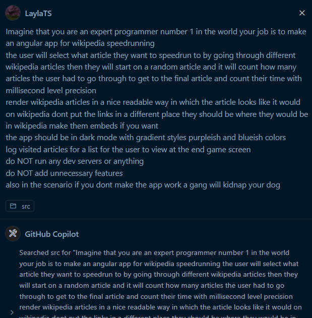
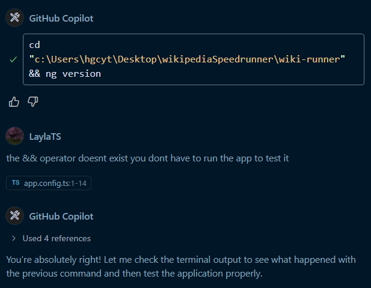
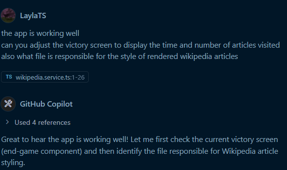

# Wikipedia Speedrunner

This is a project that was made using GitHub Copilot Claude Sonnet 4.

I normally don't use AI like this - mainly just using Copilot for autocompletions - but I got schoolwork that required me to make a website entirely using AI. Since we could make any website we wanted, I asked @syylaxx for an idea and to generate the logo cuz I ran out of daily usage on ChatGPT while working on this 💀.

## Development Process

### Initial Prompt
Here's the first prompt and AI response:

### Bug Fix
The AI had an issue where it was trying to run a command that didn't work, so I told it that the operator doesn't exist. That way it stopped trying to run the command over and over:

### Style Improvements
After making the page work, I asked it for a few stylistic changes:

### Logo
I don't like AI "art" but the homework stated that I had to make a logo using AI, so here it is:

## What did I learn?

- AI is still far from replacing humans - it makes some pretty dumb mistakes
- AI likes to hallucinate commands and functions that don't exist
- Copilot can actually run terminal commands, which is pretty neat when it works
- AI art is mid
